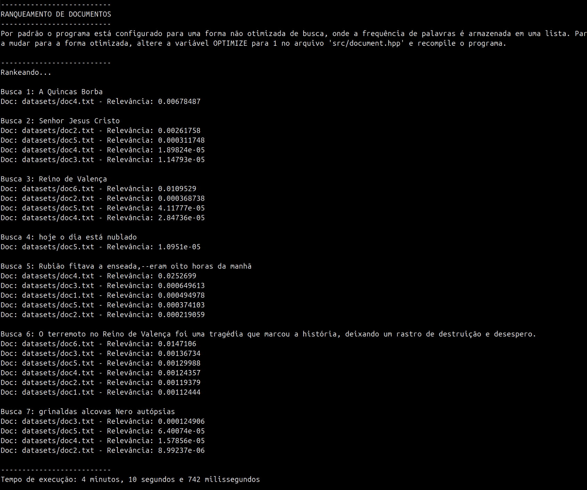
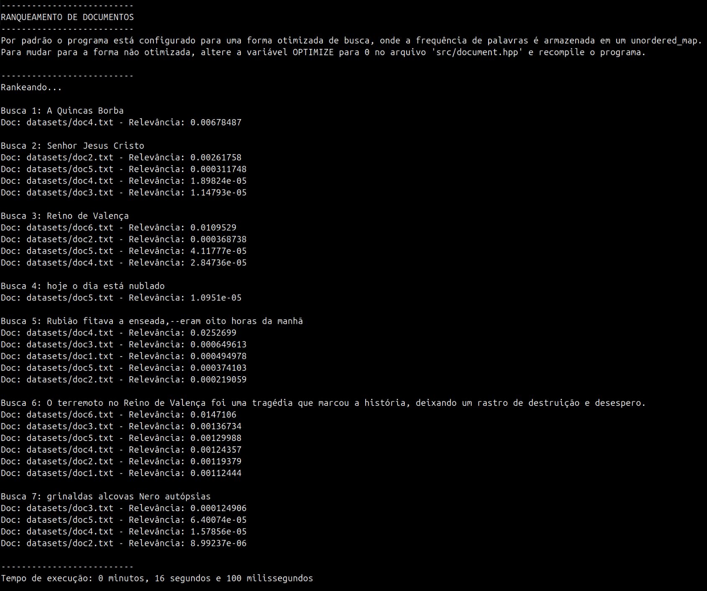

## 🔍 Introdução

<div align='justify'>

  Este [trabalho][trabalho-url] (Ranqueamento de Documentos) foi proposto na disciplina de Algoritmos e Estruturas de Dados II (AEDSII) pelo professor [Michel Pires da Silva][github-prof].

  O ranqueamento de documentos é uma técnica utilizada para ordenar documentos de acordo com sua relevância em relação a uma consulta. A técnica TF-IDF (Term Frequency-Inverse Document Frequency) é uma das mais utilizadas nesse contexto e, por sua simplicidade e eficiência, foi escolhida para ser testada neste trabalho.

</div>

<p align="right">(<a href="#readme-topo">voltar ao topo</a>)</p>

## 💡 Fundamentação Teórica

<div align='justify'>

  Em 1972, **Karen Spärck Jones** propôs a técnica TF-IDF no *Journal of Documentation* em um artigo chamado "A statistical interpretation of term specificity and its application in retrieval", onde ela, além de propor este algoritmo, também propôs outras técnicas de ranqueamento de documentos [^1].

  Neste trabalho, utilizou-se um pouco da ideia deste algoritmo para fazer o ranqueamento os documentos. 
  
  A técnica TF-IDF é uma técnica de ranqueamento de documentos que leva em consideração a frequência de um termo em um documento e a frequência inversa de um termo em todos os documentos. A técnica é composta por duas partes: a frequência de um termo em um documento (TF) e a frequência inversa de um termo em todos os documentos (IDF).

  ### TF (Term Frequency)
  É a frequência de um termo em um documento. Ela é calculada apartir da quantidade de vezes que um termo aparece em um documento, dividido pela soma das frequências de todos os termos no documento. A frequência de um termo em um documento é calculada pela fórmula:

  $$f_{t,d} = \frac{f_{t,d}}{\sum_{t' \in d} f_{t',d}}$$

  Onde:
  - $f_{t,d}$ é a frequência do termo t no documento d.
  - $\sum_{t' \in d} f_{t',d}$ é a soma das frequências de todos os termos no documento d. 

  ### IDF (Inverse Document Frequency)
  É a frequência inversa de um termo em todos os documentos. Ela é calculada apartir da quantidade de documentos que contém um termo, dividido pelo total de documentos. A frequência inversa de um termo em todos os documentos é calculada pela fórmula: 

  $$idf_t = \log\left(\frac{N}{n_t}\right)$$

  Onde:
  - $N$ é o total de documentos.
  - $n_t$ é a quantidade de documentos que contém o termo t.

  ### TF-IDF (Term Frequency-Inverse Document Frequency)

  O fator TF-IDF é calculado multiplicando-se a frequência de um termo em um documento pela frequência inversa de um termo em todos os documentos. A fórmula para o cálculo do fator TF-IDF é: 

  $$tfidf_{t,d} = f_{t,d} \times idf_t$$

  Onde:
  - $tfidf_{t,d}$ é o fator TF-IDF do termo t no documento d.
  - $f_{t,d}$ é a frequência do termo t no documento d.
  - $idf_t$ é a frequência inversa do termo t em todos os documentos.

  ### Relevância dos Documentos

  A relevância dos documentos é calculada somando-se os fatores TF-IDF de cada termo da frase buscada em cada documento. A relevância de um documento é calculada pela fórmula:

  $$relevance_d = \sum_{t \in q} tfidf_{t,d}$$

  Onde:
  - $relevance_d$ é a relevância do documento d.
  - $q$ é a frase buscada.
  - $tfidf_{t,d}$ é o fator TF-IDF do termo t no documento d.

  ### Ranqueamento dos Documentos

  Após o cálculo da relevância dos documentos, eles são ordenados em ordem crescente de relevância. O documento com maior relevância é o primeiro da lista e o documento com menor relevância é o último.

</div>

<p align="right">(<a href="#readme-topo">voltar ao topo</a>)</p>

## 🎯 Objetivos

<div align="justify">

  ### Objetivo Geral
  O objetivo deste trabalho é de, através da utilização das estruturas de dados já estudadas até o momento, implementar um algoritmo de ranqueamento de documentos que lança mão da técnica TF-IDF (Term Frequency-Inverse Document Frequency).

  ### Objetivos Específicos
  - Abordar e reforçar conceitos de análise de algoritmos e estruturas de dados já explorados no contexto da disciplina.
  - Refletir sobre como novas estruturas de dados, como as árvores binárias e os grafos, podem influenciar na resolução do problema proposto e quais ganhos de eficiência poderiam ser alcançados.

</div>

<p align="right">(<a href="#readme-topo">voltar ao topo</a>)</p>

## 🔬 Modelagem de Aplicação 

<div aling='justify'>

  A partir dos conceitos e do entendimento absorvido sobre o algoritmo, a implementação é um passo de extrema importância para garantir que os resultados sejam satisfatórios. Veremos as implementações, escolhas e otimizações feitas para obter um melhor desempenho do algoritmo e uma melhor precisão dos resultados, detalhando onde cada aspecto está no código e como as estruturas foram realmente utilizadas.

  ### Leitura dos Documentos

  No início do programa, todos os documentos são lidos e cada palavra é adicionada em uma lista ou em uma Hash Table. No código, essa parte está implementada nas funções [`readFile()`](src/document.cpp) e [`addWord()`](src/document.cpp) localizada no arquivo [`document.cpp`](src/document.cpp). Durante a leitura, cada palavra é processada e armazenada conforme a estrutura de dados selecionada. A Hash Table ([`wordsFreq`](src/document.hpp)) foi utilizada na versão otimizada devido ao acesso rápido, o que melhora o desempenho ao lidar com grandes quantidades de documentos e termos. Já a lista encadeada ([`docWords`](src/document.cpp)) foi usada como uma alternativa para explorar a implementação com estruturas de dados clássicas, atendendo ao objetivo pedagógico do projeto e permitindo uma comparação direta entre as duas abordagens.

  Cada palavra que foi armazenada na estrutura de dados foi colocada como uma [`struct WordFreq`](src/document.hpp) que contém o termo e a frequência do termo no documento. A estrutura [`wordsFreq`](src/document.hpp) foi definida no arquivo [`document.hpp`](src/document.hpp).

  A escolha entre Hash Table e lista é feita por meio de um parâmetro de configuração definido pelo usuário em um [`#define OPTIMIZE`](src/document.hpp) no programa. Essa flexibilidade foi implementada para permitir a comparação do desempenho e da eficácia de ambas as abordagens.

  ### Normalização dos Textos

  As palavras lidas dos textos são armazenadas nas estruturas em uma forma normalizada. Durante o processo de normalização, são removidos caracteres não alfanuméricos, acentos são retirados das letras e as palavras são convertidas para letras minúsculas. Esse processo é implementado na função [`normalize()`](src/document.cpp), também presente no arquivo [`document.cpp`](src/document.cpp). A função utiliza a biblioteca [`<algorithm>`](https://www.cplusplus.com/reference/algorithm/) a função [`std::transform()`](https://www.cplusplus.com/reference/algorithm/transform/) para conversão em minúsculas e uma lógica customizada para remoção de acentos e caracteres especiais. Esse procedimento visa garantir que palavras semelhantes, mas escritas de formas ligeiramente diferentes, sejam tratadas como equivalentes, aumentando a precisão do ranqueamento. Além disso, contém o `namespace` [`std::codecvt_utf8_utf16`](https://www.cplusplus.com/reference/locale/codecvt_utf8_utf16/), da biblioteca [`<codecvt>`](https://www.cplusplus.com/reference/locale/codecvt/)  temos as classes [`std::wstring_convert`](https://www.cplusplus.com/reference/locale/wstring_convert/) e [`std::codecvt_utf8_utf16`](https://www.cplusplus.com/reference/locale/codecvt_utf8_utf16/), que são utilizadas para converter strings de e para wide strings e também [`<cwchar>`](https://www.cplusplus.com/reference/cwchar/), que contém funções para manipulação de wide strings.

  ### Cálculo do TF-IDF

  Para ranquear os documentos, foi utilizado o algoritmo TF-IDF (Term Frequency-Inverse Document Frequency). A implementação do cálculo do TF-IDF está presente no arquivo [`ranking.cpp`](src/ranking.cpp), nas funções [`calculareIDF()`](src/ranking.cpp), [`calculateTFIDF()`](src/ranking.cpp) e [`calculateRelevanceDoc()`](src/ranking.cpp). Não é necessário calcular o TF diretamente pois a frequência de cada termo em cada documento já foi calculada durante a leitura dos documentos. 

  Primeiro, o calculo da frequência (TF) de cada termo em cada documento é feito durante a leitura dos documentos. Em seguida, é calculada a frequência inversa de cada termo em todos os documentos (IDF) e armazenada em uma Hash Table ([`wordsidf`](src/document.hpp)). Por fins de implemetação, foi feita a soma de `+1` tanto no numerador quanto no denominador para evitar divisão por zero, ficando então a fórmula de cálculo do IDF da seguinte forma:

  $$idf_t = \log\left(\frac{N+1}{n_t+1}\right)$$
  
  
  Depois, o fator TF-IDF de cada termo em cada documento é calculado na função [`calculateTFIDF()`](src/ranking.cpp). O cálculo do fator TF-IDF é feito multiplicando-se a frequência de um termo em um documento pela frequência inversa de um termo em todos os documentos. 

  ### Ranqueamento dos Documentos

  Após o cálculo do TF-IDF, os documentos são ranqueados em ordem crescente de relevância. A relevância de cada documento é calculada somando-se os fatores TF-IDF de cada termo da frase buscada em cada documento. A relevância de cada documento é armazenada na váriavel `relevance` que é paâmetro da classe [Document](src/document.hpp). A função [`calculateRelevanceDoc()`](src/ranking.cpp) é responsável por calcular a relevância de cada documento. 

  ### Ordenação dos Documentos

  Após o cálculo da relevância dos documentos, eles são ordenados em ordem crescente de relevância. A ordenação é feita utilizando a função [`quickSort()`](src/ranking.cpp) e a função [`partition()`](src/ranking.cpp) que estão presentes no arquivo [`ranking.cpp`](src/ranking.cpp). A função [`quickSort()`](src/ranking.cpp) é responsável por chamar a função [`partition()`](src/ranking.cpp) recursivamente para ordenar os documentos. A função [`partition()`](src/ranking.cpp) é responsável por dividir o vetor de documentos em duas partes e ordená-las de acordo com a relevância. 
  
  Com a orientação do professor, tivemos duas opções de implementação para a ordenação dos documentos: a primeira foi a utilização do algoritmo de ordenação QuickSort e a segunda foi a utilização do algoritmo de ordenação MergeSort. A escolha do algoritmo de ordenação foi feita por meio de um pequeno estudo de desempenho, dificuldade de implementação e complexidade do algoritmo. A implementação do algoritmo de ordenação QuickSort foi escolhida por ser um algoritmo de ordenação mais simples e eficiente para o problema proposto.

  ### Estrutura de Dados Utilizada

  Durante o desenvolvimento do algoritmo, foram exploradas diferentes estruturas de dados. A Hash Table foi escolhida para a versão otimizada devido ao acesso rápido, o que melhora o desempenho do programa ao lidar com grandes quantidades de documentos e termos. A lista encadeada foi utilizada como uma opção alternativa, atendendo ao objetivo pedagógico de explorar a implementação com estruturas clássicas e compará-la à abordagem otimizada. No código, a estrutura de Hash Table foi implementada com a biblioteca [`<unordered_map>`](https://www.cplusplus.com/reference/unordered_map/), enquanto a lista encadeada foi implementada utilizando a [`std::list`](https://www.cplusplus.com/reference/list/list/) da biblioteca padrão do C++.

</div>

## 🗳️ Metodologia

<div align="justify">

  As abordagens propostas para otimizar o algoritmo de ranqueamento foram implementadas em C++, utilizando a IDE Visual Studio Code para o desenvolvimento do código-fonte. O projeto foi organizado em um diretório principal, contendo subdiretórios para armazenar os arquivos de código-fonte e os datasets utilizados. A solução proposta com a aplicação da técnica TF-IDF para o ranqueamento foi dividida em classes, cada uma responsável por uma etapa do processo. A primeira, [Ranking](src/ranking.hpp), recebe as frases a serem buscadas, armazena as stopwords e lê os documentos para criar objetos da classe [Document](src/document.hpp), que armazenam os termos normalizados e suas frequências. Após isso, existe a etapa de cálculo da relevância dos termos, através de seus fatores TF/IDF em cada documento. E, por fim, a ordenação dos documentos em ordem decrescente de relevância.

  ### 📁 Arquivos 

  Para a implementação do algoritmo, o projeto foi organizado em um diretório principal, contendo subdiretórios para armazenar os arquivos de código-fonte e os datasets utilizados. A seguir, são apresentados os arquivos e diretórios utilizados no projeto:

  - [datasets/](datasets): diretório contendo os datasets utilizados.
    - [doc1.txt](datasets/doc1.txt): Primeiro documento a ser consultado, o livro "A Mão e A Luva", de Machado de Assis.
    - [doc2.txt](datasets/doc2.txt): Segundo documento a ser consultado, A Bíblia Sagrada.
    - [doc3.txt](datasets/doc3.txt): Terceiro documento a ser consultado, o livro "Dom Casmurro", de Machado de Assis.
    - [doc4.txt](datasets/doc4.txt): Quarto documento a ser consultado, o livro "Quincas Borba", de Machado de Assis.
    - [doc5.txt](datasets/doc5.txt): Quinto documento a ser consultado, o livro "A Semana", de Machado de Assis.
    - [doc6.txt](datasets/doc6.txt): Sexto documento a ser consultado, o relato histórico "Relação do formidavel, e lastimoso terremoto succedido no Reino de Valença".
    - [stopwords.txt](datasets/stopwords.txt): arquivo contendo as stopwords utilizadas da língua portuguesa. Isto é, as palavras que não possuem relevância para o ranqueamento dos documentos. Exemplo de algumas stopwords: a, ao,aos, à, às, um, uma, uns, umas, o, os, da, das, de, do, dos, e, ou, que, se, por, para, com, sem, sob, sobre, entre, etc.

  - [src/](src): diretório contendo os arquivos de código-fonte do projeto.
    - [document.cpp](src/document.cpp): Arquivo de código-fonte que contém a implementação dos métodos da classe Document, responsável por ler e representar os documentos, além de normalizar os termos que os compõem.
    - [document.hpp](src/document.hpp): Arquivo de cabeçalho que contém a definição da classe Document, responsável por representar um documento a ser ranqueado.
    - [main.cpp](src/main.cpp): arquivo contendo a função principal do programa, responsável por fazer chamadas de funções que realizam  o ranqueamento dos documentos.
    - [ranking.cpp](src/ranking.cpp): Arquivo de código-fonte que contém a implementação dos métodos da classe Ranking, responsável por ler as frases a serem buscadas, armazenar as stopwords e calcular o fator TF/IDF de cada documento para cada termo e ranqueá-los em ordem decrescente.
    - [ranking.hpp](src/ranking.hpp): Arquivo de cabeçalho que contém a definição da classe Ranking, responsável por ranquear os documentos.

  - [.gitignore](.gitignore): arquivo contendo a lista de arquivos e diretórios a serem ignorados pelo Git.
  - [make.sh](make.sh): arquivo de script para compilar o código-fonte do projeto.
  - [makefile](makefile): arquivo contendo as regras para compilar o código-fonte do projeto.
  - [README.md](README.md): arquivo contendo a documentação do projeto.

  De uma forma compacta e organizada, os arquivos e diretórios estão dispostos da seguinte forma:

  ```.
  |
  ├── datasets
  │   │   ├── doc1.txt
  │   │   ├── doc2.txt
  │   │   ├── doc3.txt
  │   │   ├── doc4.txt
  │   │   ├── doc5.txt
  │   │   ├── doc6.txt
  │   │   └── stopwords.txt
  ├── src
  │   │   ├── document.cpp
  │   │   ├── document.hpp
  │   │   ├── main.cpp
  │   │   ├── ranking.cpp
  │   │   └── ranking.hpp
  ├── .gitignore
  ├── make.sh
  ├── makefile
  └── README.md
  ```

  
</div>

<p align="right">(<a href="#readme-topo">voltar ao topo</a>)</p>

### 📚 Bibliotecas

<div align="justify">

  As bibliotecas utilizadas na implementação do algoritmo LAC são as seguintes:

  - [bits/stdc++.h](https://www.geeksforgeeks.org/bitsstdc-h-c-include/): biblioteca que inclui todas as bibliotecas padrão da linguagem C++. Veja abaixo as bibliotecas que usamos da bits/stdc++.h:
    - [iostream](https://www.cplusplus.com/reference/iostream/): biblioteca padrão de entrada e saída de dados.
    - [fstream](https://www.cplusplus.com/reference/fstream/): biblioteca para manipulação de arquivos. 
    - [sstream](https://www.cplusplus.com/reference/sstream/): biblioteca para manipulação de strings.
    - [string](https://www.cplusplus.com/reference/string/): biblioteca para manipulação de strings.
    - [cmath](https://www.cplusplus.com/reference/cmath/): biblioteca para funções matemáticas.
    - [vector](https://www.cplusplus.com/reference/vector/): biblioteca para manipulação de vetores.
    - [unordered_map](https://www.cplusplus.com/reference/unordered_map/): biblioteca para manipulação de tabelas hash.
    - [unordered_set](https://www.cplusplus.com/reference/unordered_set/): biblioteca para manipulação de conjuntos hash.
    - [list](https://cplusplus.com/reference/list/list/): biblioteca para utilização de listas duplamente encadeadas.
    - [algorithm](https://www.cplusplus.com/reference/algorithm/): biblioteca para utilização de algoritmos úteis já prontos.
    - [codecvt](https://www.cplusplus.com/reference/locale/codecvt/): biblioteca para manipulação de strings.
    - [cwchar](https://www.cplusplus.com/reference/cwchar/): biblioteca para manipulação de wide strings.
  
</div>

<p align="right">(<a href="#readme-topo">voltar ao topo</a>)</p>

### Definições e Estruturas Usadas

<div align="justify">

  Para a implementação do algoritmo, temos dois arquivos de cabeçalho e dois arquivos de código-fonte. Os arquivos de cabeçalho são responsáveis por definir as classes e estruturas utilizadas no projeto, enquanto os arquivos de código-fonte contêm a implementação dos métodos dessas classes e estruturas. Os arquivos de cabeçalho são:
  
  #### Arquivo [document.hpp](src/document.hpp)

  Neste arquivo, temos a definição da classe [`Document`](src/document.hpp), e inclui as declarações dos métodos e atributos que manipulam os documentos. A seguir estão os métodos e atributos da classe [`Document`](src/document.hpp):
  - [`#define OPTIMIZE 1`](src/document.hpp): define o tipo de estrutura de dados a ser utilizada. Se `OPTIMIZE` for 1, a estrutura de dados utilizada será a Hash Table. Se `OPTIMIZE` for 0, a estrutura de dados utilizada será a lista encadeada.
  - [`std::string normalize(const std::string &word);`](src/document.hpp): método que normaliza uma palavra, removendo caracteres não alfanuméricos, acentos e convertendo para letras minúsculas.
  - [`struct WordFreq`](src/document.hpp): estrutura que armazena um termo e sua frequência em um documento.
  - [`class Document`](src/document.hpp): classe que representa um documento a ser ranqueado:
    - [`Document(const std::string &filename, std::unordered_set<std::string> stopWords)`](src/document.hpp): construtor da classe [`Document`](src/document.hpp), que recebe o nome do arquivo do documento e um conjunto de stopwords.
    - [` std::unordered_set<std::string> stopWords`](src/document.hpp): conjunto de stopwords. 
    - [`double relevance = 0`](src/document.hpp): relevância do documento.
    - [`std::string filename`](src/document.hpp): nome do arquivo do documento.
    - [`std::unordered_map<std::string, int> wordsFreq`](src/document.hpp): tabela hash que armazena os termos e suas frequências no documento.
    - [`std::list<WordFreq> docWords`](src/document.hpp): lista encadeada que armazena os termos e suas frequências no documento.
    - [`int totalWords = 0`](src/document.hpp): total de palavras no documento.
    - [`void readFile()`](src/document.hpp): método que lê o arquivo do documento e armazena os termos e suas frequências na estrutura de dados selecionada.
    - [`void addWord(const std::string &word)`](src/document.hpp): método que adiciona um termo na estrutura de dados selecionada.
    - [`void imprimindoPalavras()`](src/document.hpp): método que imprime os termos e suas frequências no documento.
    - [`bool operator==(const Document &other) const`](src/document.hpp): sobrecarga do operador de igualdade para a classe [`Document`](src/document.hpp).
  
  - [`namespace std`](src/document.hpp): namespace que contém a definição da função de hash para a classe [`Document`](src/document.hpp).

  #### Arquivo [ranking.hpp](src/ranking.hpp)

  Neste arquivo, temos a definição da classe [`Ranking`](src/ranking.hpp), e inclui as declarações dos métodos e atributos que manipulam o ranqueamento dos documentos. A seguir estão os métodos e atributos da classe [`Ranking`](src/ranking.hpp):

  - [`class Ranking`](src/ranking.hpp): classe que ranqueia os documentos:
    - [`struct pairHash`](src/ranking.hpp): estrutura que define a função de hash para um par de strings.
    - [`private:`](src/ranking.hpp): seção privada da classe [`Ranking`](src/ranking.hpp).
      - [`std::vector<std::string> filenames`](src/ranking.hpp): vetor que armazena os nomes dos arquivos dos documentos.
    - [`public:`](src/ranking.hpp): seção pública da classe [`Ranking`](src/ranking.hpp).
      - [`Ranking(std::string phrase)`](src/ranking.hpp): construtor da classe [`Ranking`](src/ranking.hpp), que recebe a frase buscada.
      - [`std::list<Document> documents`](src/ranking.hpp): lista encadeada que armazena os documentos.
      - [`std::unordered_set<std::string> stopWords`](src/ranking.hpp): conjunto de stopwords.
      - [`std::list<std::string> phraseWords`](src/ranking.hpp): lista encadeada que armazena os termos da frase buscada.
      - [`std::unordered_map<std::string, double> wordsidf`](src/ranking.hpp): tabela hash que armazena os termos e suas frequências inversas em todos os documentos.
      - [`void readStopWords()`](src/ranking.hpp): método que lê as stopwords.
      - [`void readPhrase(const std::string &phrase)`](src/ranking.hpp): método que lê a frase buscada.
      - [`double calculateIDF(const std::string &word)`](src/ranking.hpp): método que calcula a frequência inversa de um termo em todos os documentos.
      - [`double calculateTFIDF(const std::string &term, Document doc)`](src/ranking.hpp): método que calcula o fator TF-IDF de um termo em um documento.
      - [`void calculateRelevanceDoc()`](src/ranking.hpp): método que calcula a relevância dos documentos.
      - [`void quickSort(std::list<Document> &documents, int left, int right)`](src/ranking.hpp): método que ordena os documentos em ordem decrescente de relevância.
      - [`int partition(std::list<Document> &documents, int left, int right)`](src/ranking.hpp): método que divide o vetor de documentos em duas partes e ordena-os de acordo com a relevância.

</div>

<p align="right">(<a href="#readme-topo">voltar ao topo</a>)</p>

### 📝 Funções Implementadas

<div  align="justify">
  
  As funções implementadas no projeto são responsáveis por realizar a leitura dos documentos, normalizar os termos, calcular o fator TF/IDF de cada termo em cada documento, calcular a relevância dos documentos e ordená-los em ordem decrescente de relevância. A seguir, são apresentadas as funções implementadas no projeto:

</div>

  #### Arquivo [main.cpp](src/main.cpp)

  Arquivo principal que inicializa o programa, carrega documentos, realiza buscas e exibe os resultados.

  - **Função [`main()`](src/main.cpp)**: Define uma lista de frases de busca e, para cada frase: 
    1. Inicializa um objeto `Ranking` com a frase.
    2. Calcula a relevância dos documentos.
    3. Ordena os documentos pela relevância.
    4. Exibe o nome e a relevância de cada documento no console.

  #### Arquivo [document.cpp](src/document.cpp)

  Arquivo que contém a implementação dos métodos da classe `Document`, responsável por ler e representar os documentos, além de normalizar os termos que os compõem.

  - **Construtor[ `Document(const std::string &filename, std::unordered_set<std::string> stopWords)`](src/document.cpp)**: Construtor que inicializa `filename` e `stopWords`, chamando `readFile()` para processar o conteúdo do arquivo.

  - **Método [`void Document::readFile()`](src/document.cpp)**: 
    1. Lê cada palavra do arquivo, ignora palavras de parada e normaliza as palavras restantes. 
    2. Remove caracteres especiais e divide palavras compostas para garantir precisão na frequência de palavras.

  - **Método [`void Document::addWord(const std::string &word)`](src/document.cpp)**: 
    1. Adiciona uma palavra ao documento. 
    2. Se `OPTIMIZE` estiver ativado, armazena em `wordsFreq` (unordered_map); caso contrário, em `docWords` (list).

  - **Método [`std::string normalize(const std::string &word)`](src/document.cpp)**: Normaliza uma palavra, convertendo caracteres acentuados em equivalentes sem acento e convertendo para minúsculas.

  - **Método [`void Document::imprimindoPalavras()`](src/document.cpp)**: Imprime todas as palavras e suas frequências no console, de acordo com o modo de otimização (`OPTIMIZE`).

  #### Arquivo [ranking.cpp](src/ranking.cpp)

  Arquivo que contém a implementação dos métodos da classe `Ranking`, responsável por ler as frases a serem buscadas, armazenar as stopwords e calcular o fator TF/IDF de cada documento para cada termo e ranqueá-los em ordem decrescente.

  - **Construtor [`Ranking(std::string phrase)`](src/ranking.cpp)**: Construtor que inicializa `documents` com base nos arquivos em `filenames`, lê palavras de parada e processa a frase de busca.

  - **Método [`void Ranking::readStopWords()`](src/ranking.cpp)**: Lê o arquivo de stopwords e insere cada palavra, normalizada, em `stopWords`.

  - **Método [`void Ranking::readPhrase(const std::string &phrase)`](src/ranking.cpp)**: Processa a frase de busca, removendo caracteres especiais, normalizando as palavras e ignorando palavras de parada.

  - **Método [`double Ranking::calculateIDF(const std::string &term)`](src/ranking.cpp)**: Calcula o IDF de uma palavra, com base na proporção de documentos que a contêm.

  - **Método [`double Ranking::calculateTFIDF(const std::string &term, Document doc)`](src/ranking.cpp)**: Calcula o valor TF-IDF de uma palavra específica em um documento, multiplicando o TF pelo IDF.

  - **Método [`void Ranking::calculateRelevanceDoc()`](src/ranking.cpp)**: Para cada documento, calcula a relevância com base nas palavras da frase de busca.

  - **Método [`void Ranking::quickSort(std::list<Document> &documents, int left, int right)`](src/ranking.cpp)**: Implementação do QuickSort para ordenar a lista de documentos de acordo com sua relevância.

  - **Método [`int Ranking::partition(std::list<Document> &documents, int left, int right)`](src/ranking.cpp)**: Particiona o vetor de documentos em duas partes e ordena-os de acordo com a relevância.  
  
<p align="right">(<a href="#readme-topo">voltar ao topo</a>)</p>


## 📊 Testes e Resultados

<div align="justify">

Para avaliar a eficáência do algoritmo de ranqueamento de documentos, foram realizados testes com diferentes frases de busca e documentos. Vamos observar a diferença de desempenho entre as duas estruturas de dados utilizadas, a lista encadeada e a Hash Table, e analisar a precisão dos resultados obtidos.

### Configuração dos Testes

Os testes foram realizados com diferentes frases de busca e documentos. As frases de busca foram escolhidas aleatoriamente e os documentos utilizados foram trechos de livros e relatos históricos. Os documentos foram escolhidos para conter termos comuns e raros, a fim de avaliar a eficácia do algoritmo em diferentes cenários. 

  - **Documentos**: 6 documentos de diferentes tamanhos, contendo textos de domínios variados.
    - [doc1.txt](datasets/doc1.txt): "A Mão e A Luva", de Machado de Assis.
    - [doc2.txt](datasets/doc2.txt): A Bíblia Sagrada.
    - [doc3.txt](datasets/doc3.txt): "Dom Casmurro", de Machado de Assis.
    - [doc4.txt](datasets/doc4.txt): "Quincas Borba", de Machado de Assis.
    - [doc5.txt](datasets/doc5.txt): "A Semana", de Machado de Assis.
    - [doc6.txt](datasets/doc6.txt): "Relação do formidavel, e lastimoso terremoto succedido no Reino de Valença".
  - **Frases de Buscas**: 7 frases de busca, contendo termos de diferentes frequências e relevâncias.
    - *"A Quincas Borba"*: resultado esperado é o documento "Quincas Borba".
    - *"Senhor Jesus Cristo"*: resultado esperado é o documento "A Bíblia Sagrada".
    - *"Reino de Valença"*: resultado esperado é o documento "Relação do formidavel, e lastimoso terremoto succedido no Reino de Valença".
    - *"hoje o dia está nublado"*: frase aleatória, sem correspondência com os documentos.
    - *"Rubião fitava a enseada,--eram oito horas da manhã"*: trecho do livro "Quincas Borba".
    - *"O terremoto no Reino de Valença foi uma tragédia que marcou a história, deixando um rastro de destruição e desespero"*: frase com termos específicos presentes um pouco em cada documento.
    - *"grinaldas alcovas Nero autópsias"*: palavras diferentes encontradas cada uma em um documento diferente.
  - **Stopwords**: 1 arquivo contendo stopwords da língua portuguesa, este arquivo foi disponibilizado pelo professor contendo 264 palavras ([stopwords.txt](datasets/stopwords.txt))
  - **Otimização**: A otimização foi feita por meio de um parâmetro de configuração, `#define OPTIMIZE 1`, que define a estrutura de dados a ser utilizada. Se `OPTIMIZE` for 1, a estrutura de dados utilizada será a Hash Table. Se `OPTIMIZE` for 0, a estrutura de dados utilizada será a lista encadeada.

### Execução

Os resultados dos testes foram avaliados com base na precisão e no desempenho do algoritmo. A precisão foi avaliada comparando os resultados obtidos com os resultados esperados. O desempenho foi avaliado com base no tempo de execução do algoritmo, medido em milissegundos. Os resultados dos testes foram comparados entre a lista encadeada e a Hash Table para avaliar a eficácia de cada estrutura de dados.

- **1° Execução**: Execução sem utilizar a otimização: 

</div> 

<div align='center'>
     
  <p>Figura 1: Resultados da execução sem otimização.</p>
</div>

- **2° Execução**: Execução utilizando a otimização:

<div align='center'>
     
  <p>Figura 2: Resultados da execução com otimização.</p>
</div>

### Testes de Precisão

<div align="justify">

Por meio da lógica de ranqueamento com o algoritmo **TF-IDF**, o sistema conseguiu priorizar documentos relevantes com base nos termos buscados. Isso foi verificado ao observar que, para consultas como *"A Quincas Borba"*, o sistema ranqueou o documento [`doc4.txt`](datasets/doc4.txt), que corresponde ao livro "Quincas Borba" de Machado de Assis, como o mais relevante. O mesmo padrão foi observado nas demais buscas, como *"Senhor Jesus Cristo"* e *"Reino de Valença"*, onde os documentos mais relevantes foram ranqueados no topo, demonstrando precisão na identificação dos documentos de acordo com a relevância dos termos.

Para frases aleatórias, como *"hoje o dia está nublado"*, que não têm correspondência clara com nenhum documento, o sistema ainda retornou relevâncias próximas de zero, indicando que a estrutura de ranqueamento é eficiente em discriminar termos irrelevantes ou que não estão presentes nos documentos.

Esses resultados destacam a capacidade do algoritmo de lidar com palavras comuns e raras de forma eficiente, mostrando que o ranqueamento considera a frequência e a importância dos termos em cada contexto.

### Testes de Desempenho

Para avaliar o desempenho do algoritmo **TF-IDF**, utilizamos duas estruturas de dados diferentes: a Hash Table implementada com [`unordered_map`](https://www.cplusplus.com/reference/unordered_map/) e a lista encadeada implementada com [`std::list`](https://www.cplusplus.com/reference/list/list/). Cada uma dessas estruturas foi escolhida para armazenar e gerenciar a frequência de palavras nos documentos durante o processo de ranqueamento.

  - **COMPORTAMENTO ESTRUTURAL:**
    - **Lista Encadeada (`std::list`):** A [`std::list`](https://www.cplusplus.com/reference/list/list/) é uma estrutura de dados que permite inserções e remoções eficientes em qualquer posição, mas possui uma desvantagem significativa em operações de busca. Como uma lista duplamente encadeada, [`std::list`](https://www.cplusplus.com/reference/list/list/) não possui acesso direto aos elementos e, para localizar a frequência de uma palavra, é necessário percorrer todos os elementos até encontrar o termo desejado. Em termos de complexidade, a busca em uma lista encadeada tem custo $O(n)$, onde $n$ é o número de palavras na lista. Isso torna a [`std::list`](https://www.cplusplus.com/reference/list/list/) menos eficiente quando é necessário realizar buscas rápidas e repetitivas, como no cálculo de **TF-IDF** para múltiplos termos em diferentes documentos.

    - **Hash Table (`unordered_map`):** A [`unordered_map`](https://www.cplusplus.com/reference/unordered_map/) é uma estrutura de dados implementada em C++ que utiliza uma função de hash para mapear chaves (neste caso, palavras) diretamente para suas frequências. Isso permite uma busca em tempo constante $O(1)$ na maioria dos casos, já que o mapeamento direto evita a necessidade de percorrer a estrutura inteira. Em um contexto de ranqueamento de documentos, onde cada busca pode envolver múltiplos termos, essa eficiência na busca torna a [`unordered_map`](https://www.cplusplus.com/reference/unordered_map/) a estrutura ideal, especialmente ao lidar com termos raros e específicos que possuem alta relevância no algoritmo **TF-IDF**.

### Resultados e Análise

Abaixo estão os tempos de execução obtidos para cada estrutura de dados:
  - *SEM OTIMIZAÇÃO (`std::list`):* **4 minutos, 10 segundos e 742 milissegundos.**
  - *COM OTIMIZAÇÃO (`unordered_map`):* **16 segundos e 100 milissegundos.**

Esses resultados mostram que o uso da [`unordered_map`](https://www.cplusplus.com/reference/unordered_map/) proporciona uma melhoria significativa no desempenho do sistema, reduzindo drasticamente o tempo de execução. Essa diferença é especialmente evidente em buscas com termos específicos e menos frequentes, que são fundamentais para o cálculo do IDF (Inverso da Frequência de Documento) no **TF-IDF**. Ao buscar por termos raros, como *"Reino de Valença"*, a [`unordered_map`](https://www.cplusplus.com/reference/unordered_map/) permite acessar rapidamente as frequências de *"Reino"* e *"Valença"* em cada documento, sem precisar iterar por todos os termos. Em contraste, uma busca com [`std::list`](https://www.cplusplus.com/reference/list/list/) exigiria percorrer toda a lista para cada termo, aumentando significativamente o tempo de processamento.

**Vantagens do Uso de [`unordered_map`](https://www.cplusplus.com/reference/unordered_map/) no Algoritmo TF-IDF**

A escolha pela [`unordered_map`](https://www.cplusplus.com/reference/unordered_map/) oferece várias vantagens específicas para o algoritmo **TF-IDF**:

  - *Acesso Rápido a Termos Específicos:* Como cada termo é mapeado diretamente para um índice, a [`unordered_map`](https://www.cplusplus.com/reference/unordered_map/) permite acessar a frequência de qualquer termo instantaneamente. Isso é particularmente útil ao ranquear documentos onde termos raros têm mais peso, pois o **TF-IDF** atribui uma relevância maior a termos menos frequentes.

  - *Escalabilidade:* Em cenários com grandes volumes de dados ou documentos extensos, o tempo de execução usando [`unordered_map`](https://www.cplusplus.com/reference/unordered_map/) permanece quase constante para buscas, tornando-o mais escalável em comparação à [`std::list`](https://www.cplusplus.com/reference/list/list/).

  - *Eficiência no Ranqueamento de Documentos:* Como o ranqueamento envolve múltiplas buscas de termos em cada documento, a eficiência da [`unordered_map`](https://www.cplusplus.com/reference/unordered_map/) em operações de busca resulta em uma experiência de processamento muito mais rápida, especialmente ao comparar o desempenho em um conjunto de documentos grandes e termos raros.

</div>

<p align="right">(<a href="#readme-topo">voltar ao topo</a>)</p>

## Análise Hipotética: Uso de Árvores/Grafos para Ranqueamento de Documentos

<div align="justify">

Além do **TF-IDF**, que se baseia em estatísticas de frequência de termos para ranquear documentos, outra abordagem comum em recuperação de informação é o uso de estruturas de dados hierárquicas, como `árvores` e `grafos`. Essas estruturas podem ser usadas para representar relações entre documentos e termos de forma a capturar conexões e similaridades entre os documentos de forma mais complexa e semântica.

### Estruturas de Árvores para Ranqueamento

  - **Árvores de Decisão:** Uma árvore de decisão poderia ser utilizada para ranquear documentos em relação a uma consulta, onde cada nó da árvore representa uma decisão baseada em um termo ou conjunto de termos. Ao navegar na árvore, o sistema poderia "filtrar" documentos com base em termos relevantes para a consulta, terminando em folhas que contêm os documentos mais relevantes. Essa abordagem permite uma navegação direcionada, reduzindo o número de documentos a serem ranqueados a partir de uma divisão hierárquica.

  - **Árvores de Sufixos:** Outra alternativa seria o uso de árvores de sufixos, que são eficientes para buscas rápidas de substrings em grandes coleções de texto. Ao utilizar uma árvore de sufixos, cada termo de busca poderia ser rapidamente localizado, identificando os documentos que contêm os termos exatos ou variações desses termos. Essa estrutura permite que buscas de frases exatas sejam realizadas em tempo linear, o que poderia ser vantajoso em consultas específicas ou quando se deseja encontrar correspondências exatas.

### Uso de Grafos para Capturar Relações entre Termos e Documentos

O uso de grafos representa uma abordagem mais avançada para ranqueamento, capturando não apenas a presença ou ausência de termos, mas também as relações entre os documentos:

  - **Grafos de Similaridade:** Em um grafo de similaridade, cada nó representa um documento, e arestas são criadas entre documentos com base em similaridades (por exemplo, documentos que compartilham um alto número de termos ou tópicos em comum). Utilizando algoritmos de análise de grafos, como PageRank ou HITS, seria possível identificar documentos centrais na rede de documentos. Essas centralidades podem indicar documentos que são mais relevantes ou influentes em um determinado tópico, melhorando o ranqueamento com base em contextos mais amplos.

  - **Modelos de Redes Semânticas:** Outra abordagem com grafos envolve a criação de redes semânticas onde termos e documentos são representados como nós. As arestas indicam a relação semântica entre termos ou entre termos e documentos, capturando não apenas frequências de palavras, mas também o significado e o contexto dos termos. Em literaturas mais modernas de recuperação de informação, modelos como esses são utilizados em Word Embeddings e Grafo de Conhecimento para ranquear documentos de maneira mais precisa, considerando contextos semânticos além de apenas frequências de palavras.

## Comparação com o **TF-IDF**

Embora o **TF-IDF** seja um método eficaz para ranquear documentos em termos de frequência de palavras e inverta a relevância baseada na raridade dos termos, ele não captura relacionamentos complexos ou semânticos entre os documentos. O uso de árvores e grafos, por outro lado, permite:

  - **Modelagem de Relacionamentos entre Documentos:** Grafos, por exemplo, podem modelar similaridades e relações entre documentos com uma profundidade que o **TF-IDF** não oferece. Isso é especialmente útil em coleções de documentos onde o contexto é importante, pois essas estruturas permitem identificar documentos que são semântica ou contextualmente próximos entre si.

  - **Escalabilidade com Navegação Estruturada:** Estruturas de árvore, como árvores de decisão ou de sufixos, permitem uma divisão estruturada dos documentos, otimizando a navegação em grandes volumes de dados, enquanto o **TF-IDF** trata cada termo de forma independente e linear.

  - **Análise Semântica:** Enquanto o **TF-IDF** se limita a uma análise estatística, grafos e árvores permitem uma análise semântica mais complexa, capturando significados e contextos, o que pode levar a um ranqueamento mais preciso em consultas que envolvem termos ambíguos ou contextos específicos.

Portanto, o uso de árvores e grafos no ranqueamento de documentos proporciona um nível de sofisticação superior ao **TF-IDF**, especialmente quando se lida com documentos inter-relacionados ou com a necessidade de entender conexões semânticas entre termos. No entanto, essas estruturas também têm um custo computacional maior e complexidade de implementação que devem ser considerados. Em contextos de sistemas de busca onde a precisão semântica e a relação entre documentos são críticas, árvores e grafos oferecem uma abordagem mais robusta, sendo amplamente discutidos e implementados na literatura de Recuperação de Informação e Processamento de Linguagem Natural.

</div>

<p align="right">(<a href="#readme-topo">voltar ao topo</a>)</p>


## 🏁 Conclusão
